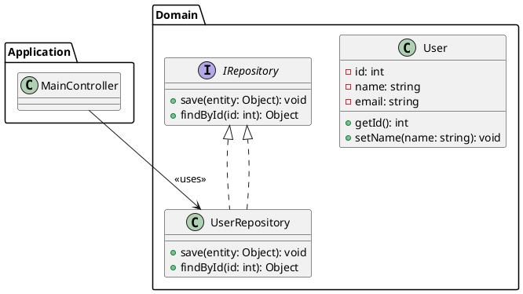

# PlantUML to Enterprise Architect Converter

This repository contains JavaScript scripts for Enterprise Architect that convert PlantUML diagrams written in note elements into actual EA UML components.

## Scripts

### 1. PlantUML-to-EA-Converter.js (Basic Version)
A basic converter that handles:
- Classes and interfaces
- Packages
- Basic relationships (Association, Dependency, Generalization, Realization)
- Simple attributes

### 2. PlantUML-to-EA-Converter-Enhanced.js (Recommended)
An enhanced converter with support for:
- **Classes** with full attribute and method definitions
- **Interfaces** with method signatures
- **Packages** (including nested packages)
- **Relationships**: Association, Dependency, Generalization, Realization, Aggregation, Composition
- **Visibility modifiers**: `+` (Public), `-` (Private), `#` (Protected), `~` (Package)
- **Stereotypes**: `<<stereotype>>` notation
- **Abstract classes**
- **Array types** in attributes
- **Method parameters** with types
- **Return types** for methods
- **Detailed statistics** and logging

## Installation

1. Open Enterprise Architect
2. Go to **Tools** → **Scripting** → **Script Management** (or press `Ctrl+Shift+Alt+S`)
3. In the Script Management window:
   - Right-click on the script group where you want to add the script
   - Select **New Script**
   - Give it a name (e.g., "PlantUML Converter Enhanced")
   - Select **JavaScript** as the language
4. Copy the contents of `PlantUML-to-EA-Converter-Enhanced.js` and paste it into the script editor
5. Save the script

## Usage

### Step 1: Prepare Your PlantUML Code
Create a PlantUML diagram in a `.puml` file or copy the PlantUML code you want to convert.

Example PlantUML code:


### Step 2: Create a Note Element in EA
1. Open or create a diagram in Enterprise Architect
2. From the toolbox, select **Note** element
3. Draw the note on your diagram
4. Double-click the note to open its properties
5. In the **Notes** field, paste your PlantUML code
6. Click **OK** to save

### Step 3: Run the Script
1. Select the note element you just created (click on it)
2. Go to **Tools** → **Scripting** → **[Your Script Group]** → **PlantUML Converter Enhanced**
3. The script will:
   - Parse the PlantUML code from the note
   - Create packages, classes, and interfaces in the current diagram's package
   - Add all elements to the diagram
   - Create relationships between elements
   - Display a summary in the System Output window

### Step 4: View Results
1. Check the **System Output** window (View → System Output) for:
   - Progress messages
   - Statistics about created elements
   - Any warnings or errors
2. The diagram will automatically refresh to show all created elements
3. You can now:
   - Rearrange elements using EA's layout features
   - Modify elements as needed
   - Generate documentation

## Supported PlantUML Syntax

### Elements
- **Packages**: `package "Name" { }` or `package Name as Alias { }`
- **Classes**: `class ClassName { }`
- **Abstract Classes**: `abstract class ClassName { }`
- **Interfaces**: `interface InterfaceName { }`
- **Stereotypes**: `class ClassName <<stereotype>> { }`

### Attributes and Methods
```plantuml
class Example {
    +publicAttribute: string
    -privateAttribute: int
    #protectedAttribute: float
    ~packageAttribute: bool
    
    +publicMethod(param: string): void
    -privateMethod(): int
    #protectedMethod(p1: int, p2: string): bool
}
```

### Relationships
```plantuml
' Association
ClassA --> ClassB : <<uses>>

' Dependency
ClassA ..> ClassB : <<depends>>

' Generalization (Inheritance)
SubClass --|> SuperClass

' Realization (Interface Implementation)
ConcreteClass ..|> Interface

' Aggregation
Container o-- Part

' Composition
Container *-- Part
```

### Inline Relationships
```plantuml
' Can also declare relationships in class definition
class ChildClass extends ParentClass {
}

class Implementation implements IInterface {
}
```

## Features and Limitations

### ✅ Supported Features
- Multiple packages (nested)
- Classes with attributes and methods
- Interfaces with method signatures
- Visibility modifiers (public, private, protected, package)
- Array types (`string[]`, `float[][]`)
- Method parameters with types
- Return types
- Stereotypes
- Abstract classes
- Multiple relationship types
- Relationship labels

### ⚠️ Limitations
- **No automatic layout optimization**: Elements are placed in a grid pattern. You may need to rearrange them manually or use EA's layout features (Diagram → Layout → Auto Layout)
- **No support for**:
  - Notes and constraints in PlantUML
  - Advanced PlantUML features (skinparam, colors, styles)
  - Activity diagrams, sequence diagrams, etc. (only class diagrams)
  - Enumerations (enums)
  - Cardinality on relationships
- **Single pass parsing**: Complex nested structures may need manual adjustment
- **Name matching**: Element references in relationships must match exactly

## Troubleshooting

### "No object selected" Error
**Solution**: Make sure you've selected the note element before running the script.

### "Selected object is not a note" Error
**Solution**: The script only works with Note elements. Create a note and paste your PlantUML code in its Notes field.

### "Source/Target element not found" Warning
**Solution**: This means a relationship refers to an element that wasn't created. Check:
- Element names match exactly in the relationship
- The element was declared before the relationship
- There are no typos in element names

### Elements not showing attributes/methods
**Solution**: Make sure:
- Your PlantUML code has the element body in curly braces `{ }`
- Attributes and methods are properly formatted with visibility modifiers
- The element is not closed before attributes/methods are declared

### Diagram looks messy
**Solution**: After conversion, use EA's layout features:
1. Select all elements: `Ctrl+A`
2. Go to **Diagram** → **Layout** → **Diagram Layout**
3. Choose a layout algorithm (e.g., "Hierarchical" or "Circular")
4. Click **Layout Diagram**

## Example Workflow

1. **Design in PlantUML**: Use PlantUML's simple text syntax to quickly design your architecture
2. **Convert to EA**: Use this script to create actual EA elements
3. **Enhance in EA**: Add additional details, constraints, and documentation in EA
4. **Generate Reports**: Use EA's powerful reporting features to generate documentation
5. **Version Control**: Keep both PlantUML source and EA model in version control

## Advanced Tips

### Organizing Large Diagrams
For large PlantUML files:
1. Split into multiple logical sections
2. Create separate notes for each section
3. Run the script on each note separately
4. This gives you better control over element placement

### Customizing Element Positioning
You can modify the script's positioning logic by adjusting these parameters:
```javascript
this.posX = 50;           // Starting X position
this.posY = 50;           // Starting Y position
this.spacingX = 200;      // Horizontal spacing
this.spacingY = 180;      // Vertical spacing
this.maxColumns = 5;      // Elements per row
```

### Batch Processing
To convert multiple PlantUML files:
1. Create multiple notes with different PlantUML code
2. Run the script on each note
3. All elements will be added to the same diagram

## Contributing

Feel free to enhance these scripts and add support for additional PlantUML features!

## License

See LICENSE file for details.

## Version History

- **v1.0** - Initial release with basic class diagram support
- **v2.0** - Enhanced version with full attribute/method parsing, better relationship support, and statistics

---

**Note**: These scripts are designed for Enterprise Architect Ultimate Edition. Some features may not be available in other editions.

